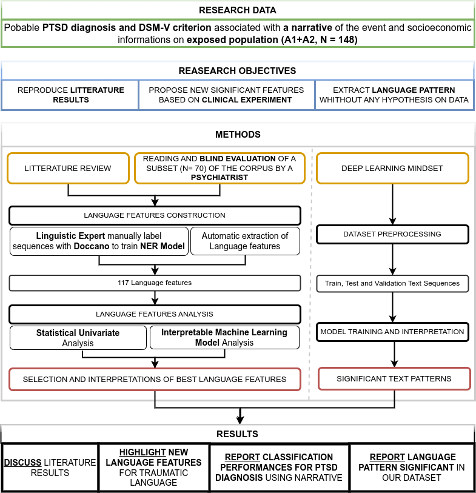

[](https://black.readthedocs.io/en/stable/the_black_code_style/current_style.html)


# LINGUISTIC CODE OF PTSD
Can language be a clinical marker of PTSD? A comprehensive approach.

This repository  can be use to reproduce a part of the results presented in the paper: 

```
Towards Unlocking the Linguistic Code of Post-Traumatic Stress Disorder: A Comprehensive Analysis and Diagnostic Approach.
```

The deep learning result can not be reproduce because it need to have access to the data. However, the code for the deep learning part is available in .... .


**contact:** psycholinguistic2125@gmail.com

# Table of content

- [0. About](#0-about)
- [1. Installation](#1-installation)
- [2. Usages](#2-usages)





## 1. Installation
To make it work:  (3.9 will also work)
- Create a virtual environment (python3.8 -m venv /path/to/env)
- Activate the environment (source /path/to/env/bin/activate)
- Clone the directory (git clone )
- Install dependencies (pip install -r requirements.txt)

## 2. Usages

To reproduce the results, you need to run the following scripts in the following order:

1. for the data description, run all cell from [data_description](data_description.ipynb)

2. for ht univariate language analysis between psychopathology and language:
```
python main_stats.py
```

3. for the machine learning analysis and interpretation:
```
run python main_ml.py 100  (for the 100 iterations of the cross validation)
```

All the result and generated figures can be found in ./results/ml_analysis and ./results/stats_analysis

